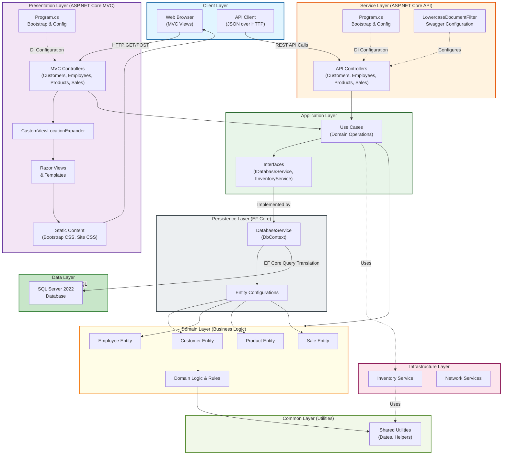
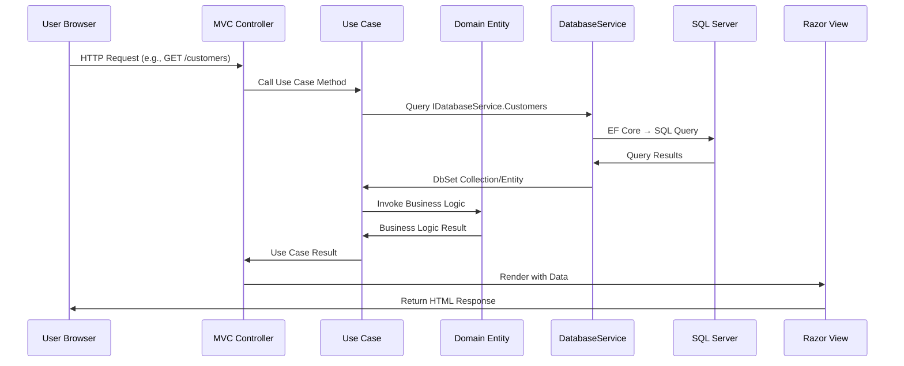
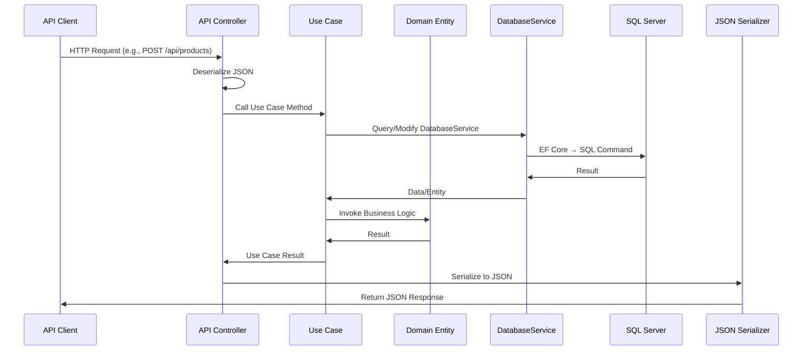
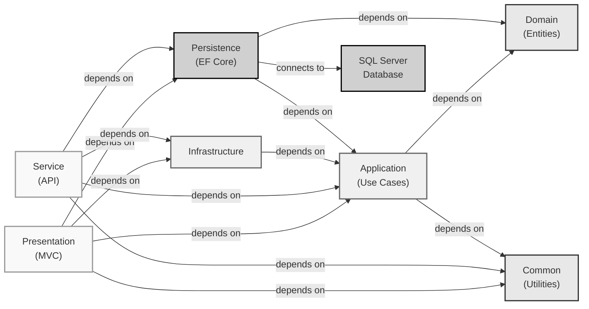

# Clean Architecture Demo - AS-IS High-Level Design Document

**Document Version:** 1.0  
**Date:** 2024-08-19  
**Repository:** Soundariya-D/clean-architecture-demo  
**License:** BSD 3-Clause

---

## Table of Contents

1. [Application Overview](#1-application-overview)
2. [Technology Stack](#2-technology-stack)
3. [Project Structure](#3-project-structure)
4. [Existing Architecture](#4-existing-architecture)
5. [Major Components](#5-major-components)
6. [Component Responsibilities](#6-component-responsibilities)
7. [Component Interaction](#7-component-interaction)
8. [High-Level Request Flow](#8-high-level-request-flow)
9. [Architecture Diagram](#9-architecture-diagram-using-mermaid)

---

## 1. Application Overview

The Clean Architecture Demo is a sample application designed to demonstrate clean architecture principles, patterns, and practices for educational purposes. Built with Microsoft .NET 9.0, this application showcases how to structure a layered architecture that maintains clear separation of concerns and promotes maintainability, testability, and scalability.

The application manages business entities across four primary domains: Customers, Employees, Products, and Sales. It provides both web-based presentation (ASP.NET Core MVC) and API-based service (RESTful API with Swagger) interfaces for interacting with the business logic.

This is a learning tool intended to accompany an online course on Clean Architecture practices, demonstrating practical implementation of architectural principles in a real-world business context.

---

## 2. Technology Stack

### Core Framework & Runtime
- **.NET Core Runtime:** .NET 9.0
- **Language:** C# .NET 13.0 with ImplicitUsings and Nullable disabled
- **IDE:** Visual Studio 2022

### Web Frameworks & APIs
- **ASP.NET Core MVC 9.0** - Web presentation layer
- **ASP.NET Core Web API 9.0** - RESTful service layer
- **Swagger/Swashbuckle 7.2.0** - API documentation and exploration

### Data Access & ORM
- **Entity Framework Core 9.0** - Object-relational mapping
- **SQL Server 2022** - Primary relational database
- **Entity Framework Core SQL Server Provider 9.0.1** - SQL Server integration

### Dependency Injection & Configuration
- **Scrutor 6.0.1** - Auto-registration of services and interfaces
- **Scrutor.AspNetCore 3.3.0** - ASP.NET Core integration for advanced dependency injection
- **Microsoft.Extensions.DependencyInjection 9.0.1** - Service container

### Testing & Mocking
- **NUnit 4.3.2** - Unit testing framework
- **NUnit3TestAdapter 4.6.0** - Test adapter for Visual Studio
- **Moq 4.20.72** - Mocking framework
- **Moq.AutoMock 3.5.0** - Automatic mock injection
- **Moq.EntityFrameworkCore 9.0.0.1** - Entity Framework mocking support
- **Microsoft.NET.Test.SDK 17.12.0** - Test SDK

### Additional Libraries
- **BDD & Specifications:** SpecFlow 3.9 (referenced in documentation)

---

## 3. Project Structure

The solution is organized into eight distinct projects following clean architecture principles:

```
CleanArchitecture.sln
├── Domain/
│   ├── Customers/
│   │   ├── Customer.cs
│   │   └── CustomerTests.cs
│   ├── Employees/
│   ├── Products/
│   ├── Sales/
│   ├── Common/
│   └── Domain.csproj
├── Common/
│   ├── Dates/
│   └── Common.csproj
├── Application/
│   ├── Interfaces/
│   │   ├── IDatabaseService.cs
│   │   ├── IInventoryService.cs
│   │   └── [other interfaces]
│   ├── Customers/
│   ├── Employees/
│   ├── Products/
│   ├── Sales/
│   └── Application.csproj
├── Infrastructure/
│   ├── Inventory/
│   ├── Network/
│   └── Infrastructure.csproj
├── Persistence/
│   ├── DatabaseService.cs
│   ├── Customers/
│   ├── Employees/
│   ├── Products/
│   ├── Sales/
│   └── Persistence.csproj
├── Service/
│   ├── Program.cs
│   ├── Customers/
│   ├── Employees/
│   ├── Products/
│   ├── Sales/
│   ├── LowercaseDocumentFilter.cs
│   ├── Service.csproj
│   ├── appsettings.json
│   └── appsettings.Development.json
├── Presentation/
│   ├── Program.cs
│   ├── CustomViewLocationExpander.cs
│   ├── Customers/
│   ├── Employees/
│   ├── Home/
│   ├── Products/
│   ├── Sales/
│   ├── Shared/
│   ├── Content/
│   ├── Presentation.csproj
│   ├── _ViewStart.cshtml
│   ├── appsettings.json
│   └── appsettings.Development.json
└── Specification/
    └── Specification.csproj
```

### Project Dependencies

- **Domain** - No external project dependencies (core business logic)
- **Common** - References: None (shared utilities)
- **Application** - References: Domain, Common (use cases and business rules)
- **Infrastructure** - References: Application (external integrations)
- **Persistence** - References: Domain, Application (data access implementation)
- **Presentation** - References: Application, Common, Domain, Infrastructure, Persistence (MVC web layer)
- **Service** - References: Application, Common, Domain, Infrastructure, Persistence (API service layer)
- **Specification** - References: None (BDD specifications)

---

## 4. Existing Architecture

### Architectural Pattern
The application implements a **Layered Clean Architecture** with clear separation of concerns across the following layers:

#### **Domain Layer (Core Business Logic)**
The innermost layer containing pure business logic independent of frameworks or external concerns. This layer defines entities and core business rules without any knowledge of how data is persisted or presented.

**Key Components:**
- Business entities (Customer, Employee, Product, Sale)
- Domain-specific logic and rules
- Common domain utilities

**Constraints:**
- No framework dependencies
- No references to outer layers
- Technology-agnostic

#### **Application Layer (Use Cases & Business Rules)**
The layer that orchestrates business logic and defines the contracts for external services. It implements use cases and coordinates interactions between the domain and infrastructure layers.

**Key Components:**
- Service interfaces (IDatabaseService, IInventoryService)
- Use case implementations
- Application-level business rules
- Data transfer objects (DTOs)
- Dependency contracts

**Constraints:**
- References only Domain and Common layers
- Contains interface definitions for external services
- No framework-specific code

#### **Infrastructure Layer (External Integrations)**
Responsible for implementing external integrations and specialized services. Provides infrastructure-level implementations that support business operations.

**Key Components:**
- Inventory management services
- Network operations
- Third-party integrations

**Constraints:**
- References Application layer
- Implements interfaces defined in Application layer

#### **Persistence Layer (Data Access)**
Manages all database interactions using Entity Framework Core with SQL Server. Implements the data access patterns and manages the DbContext.

**Key Components:**
- DatabaseService (DbContext implementation)
- Entity configurations
- Persistence-specific implementations

**Key Files:**
- `DatabaseService.cs` - DbContext managing Customers, Employees, Products, and Sales

**Constraints:**
- References Domain and Application layers
- Technology-specific (EF Core, SQL Server)

#### **Service Layer (RESTful API)**
The outer presentation layer providing a RESTful API interface. Built on ASP.NET Core Web API with Swagger documentation support.

**Key Components:**
- API controllers
- Swagger configuration (LowercaseDocumentFilter)
- API request/response handling

**Constraints:**
- References all inner layers
- ASP.NET Core specific

#### **Presentation Layer (Web UI)**
The outer presentation layer providing a web-based user interface using ASP.NET Core MVC.

**Key Components:**
- MVC controllers
- Razor views and layouts
- Custom view location expander
- Static content (Bootstrap CSS)

**Constraints:**
- References all inner layers
- ASP.NET Core MVC specific

---

## 5. Major Components

### 5.1 Domain Components

#### Customer Domain
- **Customer Entity** - Core business entity representing a customer
- **CustomerTests** - Unit tests for customer domain logic

#### Employee Domain
- Represents employee business entities

#### Product Domain
- Represents product catalog entities

#### Sales Domain
- Represents sales transactions and order information

### 5.2 Application Components

#### Database Service Interface (`IDatabaseService`)
Defines the contract for database operations. Implemented by the Persistence layer's DatabaseService.

**Responsibilities:**
- DbSet properties for Customers, Employees, Products, Sales
- Save operations
- Transaction management

#### Inventory Service Interface (`IInventoryService`)
Defines the contract for inventory-related operations, likely managing product stock levels.

### 5.3 Persistence Components

#### DatabaseService
**Location:** `Persistence/DatabaseService.cs`

**Key Responsibilities:**
- Inherits from DbContext and implements IDatabaseService interface
- Manages DbSets for four primary entities: Customers, Employees, Products, Sales
- Configures Entity Framework Core with SQL Server provider
- Initializes database schema via `Database.EnsureCreated()`
- Applies entity configurations during model creation

**Key Methods:**
- `OnConfiguring()` - Configures EF Core to use SQL Server with connection string from configuration
- `OnModelCreating()` - Applies entity configurations for all domain entities
- `Save()` - Commits changes to the database

**Dependencies:**
- IConfiguration - Retrieves database connection string
- Domain entities (Customer, Employee, Product, Sale)
- Entity configurations (CustomerConfiguration, EmployeeConfiguration, ProductConfiguration, SaleConfiguration)

### 5.4 Infrastructure Components

#### Inventory Service
Implements inventory management functionality, referenced through IInventoryService interface.

#### Network Services
Provides network-related infrastructure operations.

### 5.5 Service (API) Layer Components

#### Service Program
**Location:** `Service/Program.cs`

**Responsibilities:**
- Bootstraps the ASP.NET Core Web API application
- Configures dependency injection using Scrutor
- Loads assemblies dynamically for plugin-like behavior
- Configures Swagger documentation with LowercaseDocumentFilter

**Key Configuration:**
- Adds controllers (ASP.NET Core API controllers)
- Adds Swagger/Swagger UI for API documentation
- Implements automatic service registration from all CleanArchitecture.* assemblies
- Configures advanced dependency injection using Scrutor

#### Service Controllers
- Customers, Employees, Products, Sales controllers providing CRUD operations
- RESTful API endpoints for each domain entity

#### LowercaseDocumentFilter
Custom Swagger document filter to format API endpoints in lowercase convention.

### 5.6 Presentation (Web) Layer Components

#### Presentation Program
**Location:** `Presentation/Program.cs`

**Responsibilities:**
- Bootstraps the ASP.NET Core MVC application
- Configures dynamic assembly loading for modular architecture
- Configures custom view location expansion
- Sets up dependency injection container using Scrutor
- Configures static file serving (Bootstrap CSS)

**Key Configuration:**
- Adds MVC with Views support
- Configures CustomViewLocationExpander for flexible view discovery
- Loads assemblies dynamically (plugin pattern)
- Implements advanced dependency injection using Scrutor
- Sets up static file middleware with custom Content directory

#### CustomViewLocationExpander
**Location:** `Presentation/CustomViewLocationExpander.cs`

**Purpose:**
Expands the view location search paths to allow views to be discovered in unconventional locations, supporting a modular architecture where views can be located in separate projects.

#### MVC Controllers
- Customers, Employees, Home, Products, Sales controllers
- Handle HTTP requests and return HTML views

#### Views
- Organized by domain area (Customers, Employees, Products, Sales)
- Shared views and layouts (_ViewStart.cshtml)
- Razor template files (.cshtml)

#### Content & Static Assets
- Bootstrap CSS framework files
- Application-specific CSS (Site.css)
- Located in `Presentation/Content/` directory

---

## 6. Component Responsibilities

### By Layer

#### Domain Layer
| Component | Responsibility |
|-----------|-----------------|
| Customer, Employee, Product, Sale Entities | Encapsulate domain business logic and invariants |
| Common Domain Utilities | Provide shared domain helper functions |
| CustomerTests | Validate domain logic through unit tests |

#### Application Layer
| Component | Responsibility |
|-----------|-----------------|
| IDatabaseService | Contract for database operations interface |
| IInventoryService | Contract for inventory operations interface |
| Use Case Classes | Orchestrate domain logic to fulfill business requirements |
| Customer/Employee/Product/Sales Use Cases | Handle specific domain operations |

#### Infrastructure Layer
| Component | Responsibility |
|-----------|-----------------|
| Inventory Service Implementations | Manage product stock and availability |
| Network Services | Handle external system communications |

#### Persistence Layer
| Component | Responsibility |
|-----------|-----------------|
| DatabaseService | Manage data access through Entity Framework Core |
| Entity Configurations | Define database mapping for domain entities |

#### Service (API) Layer
| Component | Responsibility |
|-----------|-----------------|
| Program.cs | Bootstrap and configure the API application |
| API Controllers | Handle HTTP requests and route to use cases |
| LowercaseDocumentFilter | Format API documentation |

#### Presentation (Web) Layer
| Component | Responsibility |
|-----------|-----------------|
| Program.cs | Bootstrap and configure the MVC application |
| MVC Controllers | Handle HTTP requests and render views |
| Views (Razor) | Present data to users in HTML format |
| CustomViewLocationExpander | Locate views across modular projects |
| Static Content | Provide CSS and client-side assets |

---

## 7. Component Interaction

### Dependency Flow

```
Presentation (MVC)          Service (API)
      ↓                           ↓
   [Controllers] → [Controllers]
      ↓                           ↓
   Application Layer (Interfaces & Use Cases)
      ↓
   Domain Layer (Business Logic)
      ↓
   Persistence Layer (EF Core & DatabaseService)
      ↓
   SQL Server Database

Infrastructure Layer (Cross-cutting concerns)
      ↓
   [Supports all layers]
```

### Communication Patterns

#### 1. User Request → Web Controller
- User submits HTTP request to Presentation (MVC) or Service (API)
- Controller receives request with parameters

#### 2. Controller → Application Use Case
- Controller injects Application layer dependencies via constructor
- Calls use case method with request data
- Application layer orchestrates business logic

#### 3. Application → Domain
- Use case instantiates or retrieves domain entities
- Invokes business logic methods on entities
- Domain layer enforces business rules

#### 4. Application → Persistence
- Use case injects IDatabaseService (implemented by DatabaseService)
- Queries or modifies DbSets
- Calls Save() to persist changes

#### 5. Persistence → Database
- DatabaseService translates operations to SQL via EF Core
- Entity configurations define table mappings
- SQL Server stores/retrieves data

#### 6. Response Flow
- Application returns result to controller
- Controller formats response (View for MVC, JSON for API)
- Response sent to client

### Dependency Injection

Both Service and Presentation layers use Scrutor for advanced dependency injection:

```c#
builder.Services.Scan(p => p.FromAssemblies(assemblies)
    .AddClasses()
    .AsMatchingInterface());
```

This pattern:
- Loads all CleanArchitecture.* assemblies dynamically
- Automatically registers classes as their matching interfaces
- Enables plugin-like extensibility
- Reduces manual service registration boilerplate

---

## 8. High-Level Request Flow

### Request Flow Sequence

#### Web (MVC) Request Flow
1. **Client Request** - User navigates to URL or submits form
2. **Route Resolution** - Routing engine matches URL to MVC controller action
3. **Dependency Injection** - ASP.NET Core resolves controller dependencies
4. **Controller Execution** - MVC controller action executes
   - Receives user input (query parameters, form data)
   - Injects Application layer services
   - Calls application use case
5. **Application Processing** - Use case executes
   - Validates input
   - Retrieves domain entities via DatabaseService
   - Invokes domain business logic
   - May call Infrastructure services (e.g., IInventoryService)
6. **Persistence Operation** - DatabaseService interacts with database
   - Queries DbSets via EF Core
   - Applies entity configurations
   - Translates to SQL Server queries
   - Caches or retrieves data
7. **Response Processing** - Application returns results
8. **View Rendering** - Controller selects and renders Razor view
   - CustomViewLocationExpander helps locate view files
   - View models passed to template
   - HTML generated
9. **Response Delivery** - Response sent to client browser

#### API (RESTful) Request Flow
1. **Client Request** - Client sends HTTP request (GET, POST, PUT, DELETE, etc.)
2. **Route Resolution** - Routing engine matches request to API controller
3. **Request Deserialization** - JSON request body deserialized to objects
4. **Dependency Injection** - ASP.NET Core resolves controller dependencies
5. **Controller Execution** - API controller action executes
   - Validates request data
   - Injects Application layer services
   - Calls application use case
6. **Application Processing** - Use case executes (same as MVC flow)
7. **Persistence Operation** - DatabaseService interacts with database (same as MVC flow)
8. **Response Processing** - Application returns business results
9. **JSON Serialization** - Results converted to JSON
   - LowercaseDocumentFilter may transform casing
   - Swagger documentation available at `/swagger`
10. **Response Delivery** - JSON response sent to client

### Typical Entity Operation Flow (Example: Get Customer)

1. API Client sends: `GET /api/customers/123`
2. CustomerController receives request → calls CustomerUseCase.GetCustomer(123)
3. CustomerUseCase queries: `DatabaseService.Customers.Find(123)`
4. DatabaseService (DbContext) queries SQL Server
5. SQL Server returns Customer record
6. CustomerUseCase returns Customer to controller
7. Controller serializes to JSON
8. Response: `{ "id": 123, "name": "...", ... }`

### Typical Entity Modification Flow (Example: Create Product)

1. API Client sends: `POST /api/products` with product data
2. ProductController receives request → creates Product object from JSON
3. ProductController calls ProductUseCase.CreateProduct(product)
4. ProductUseCase validates business rules (domain logic)
5. ProductUseCase adds product: `DatabaseService.Products.Add(product)`
6. ProductUseCase calls: `DatabaseService.Save()`
7. DatabaseService.Save() calls SaveChanges() on DbContext
8. EF Core generates INSERT SQL
9. SQL Server inserts new product record
10. DatabaseService returns control
11. ProductUseCase returns created product to controller
12. Controller returns 201 Created response with product data

---

## 9. Architecture Diagram using Mermaid

### Overall Layered Architecture



### Request Flow Diagram (MVC)



### Request Flow Diagram (API)



### Component Dependency Graph



---

## Summary

The Clean Architecture Demo implements a sophisticated, layered architecture that prioritizes:

- **Separation of Concerns** - Each layer has distinct responsibilities
- **Testability** - Business logic isolated in Domain and Application layers
- **Maintainability** - Clear boundaries and dependencies
- **Modularity** - Plugin-like architecture using dynamic assembly loading
- **Dependency Inversion** - Dependencies flow inward; outer layers depend on inner layers
- **Technology Independence** - Core business logic free from framework dependencies

The architecture enables easy extension, replacement of infrastructure components, and maintains a clear path for evolving the system while adhering to SOLID principles.

---

**Document Generated:** 2024-08-19
**Analysis Scope:** Repository structure, dependencies, and source code examination
